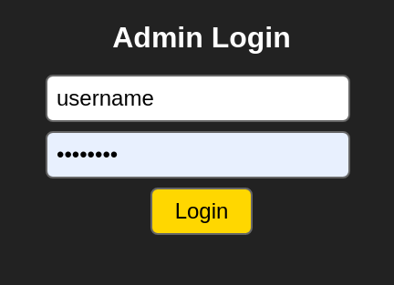
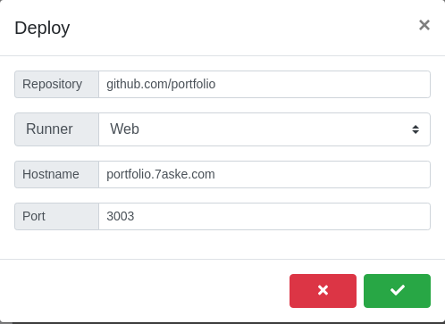
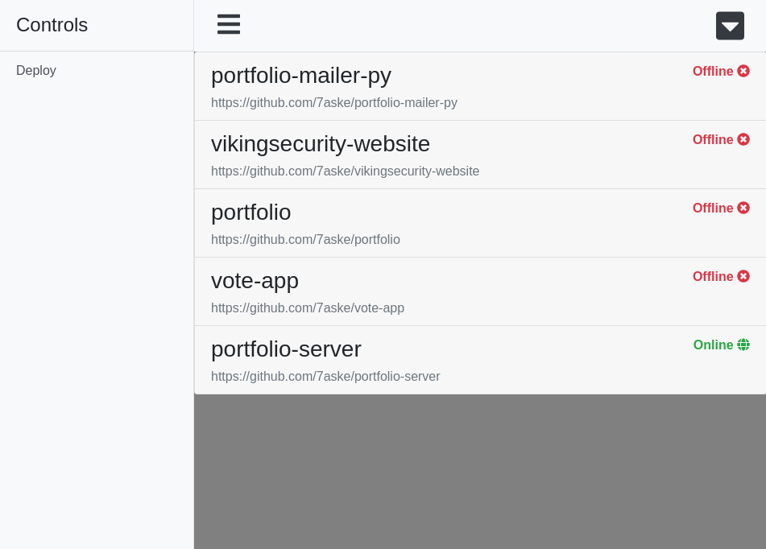
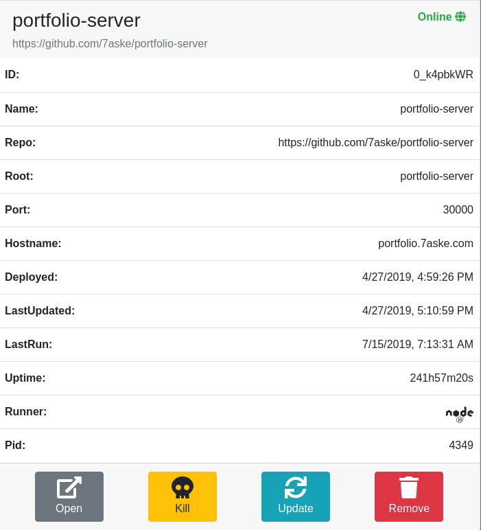

# deployment-server

## Description

Custom web-server tooled to easily deploy other web based projects (apps) using Git, inspired by Heroku. Deployment-server is designed to be a lightweight and simple to use.

## Installation

Project is being managed by `make` since Golang is, to me, pretty weird when it comes to the whole GOROOT thing. In order to install dependencies (NOTE: GOROOT must be properly set up but the project doesn't have to be in it) run:

```
make install
```

After installing dependencies build the server using:

```
make build
```

Or just do this if you want a dynamic and faster compilation:

```
make run
```

## Usage

```
# deployment-server <flags>
```

This will generate the default config file and test run the server. Default port is port `8080`.

### Config file

`config/server.cfg`

```ini
[dev]
; port for dev server and apps
appsPort = 30001
; should not be the same
port     = 30000

[router]
; router port
port = 8080

[auth]
; hash secret
secret = hashingsecret
; username and password required to log to dev server
user   = admin
pass   = admin

[deployer]
; location of where the app repos are stored relative to app root
root     = apps
; location of nodejs server script that runs 'web' apps
server   = server/server.js
; default hostname used for parsing subdomains, ignored if on local
hostname = 127.0.0.1
```

### Additional options

If you run the server with a `-i` or interactive mode you have access to quick deployment and management commands for your apps.

```
usage:

deploy          <repo>                  deploy app from specified
                                        github repository

run             <app|id>                run the deployed app
                                        with specified name or id

find            [dep|run] [app|id]      list apps based on search terms

kill            <app|id>                kill app with specified name or id

remove          <app|id>                remove app with specified name or id

settings        <app|id> <key=value>    change the settings of a deployed
                                        app based on name or id
```

## Web Interface

 | 
:-----------------------:|:-----------------------:
 | 

To login to the web-interface navigate to the port specified from the config (dev -> port). If running outside of the local network and the hostname if properly setup you can navigate to <strong>dev</strong>.hostname.com.

After logging in with the credentials from the config you are presented with not much of an interface but pressing on deploy you open up a small dialog where you can enter required settings (hostname and port are optional) and deploy a project.

Deployment-server supports node, python and plain html/css projects out of the box where html/css static content is served via a basic node server.

Error handling is quite basic at this point so be wary of potential mistakes when entering right information into the deploy dialog.

Several actions are available for each deployed server which include: starting/killing the server, removing or updating the server, opening the server hostname specified web address and if the server is not running changing its settings.

## Requirements

```
go get github.com/dgrijalva/jwt-go
go get github.com/go-ini/ini
go get github.com/pkg/errors
go get github.com/teris-io/shortid
```

## Conclusion

This is pretty bare implementation of a system that can be very useful to people that don't want to bother a lot with configuring a device to run multiple web-server applications. All contributions are welcome.
